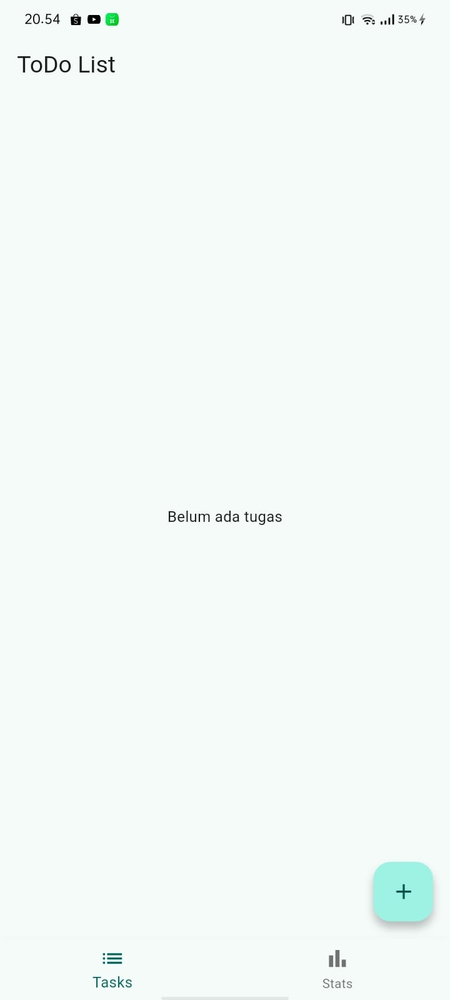
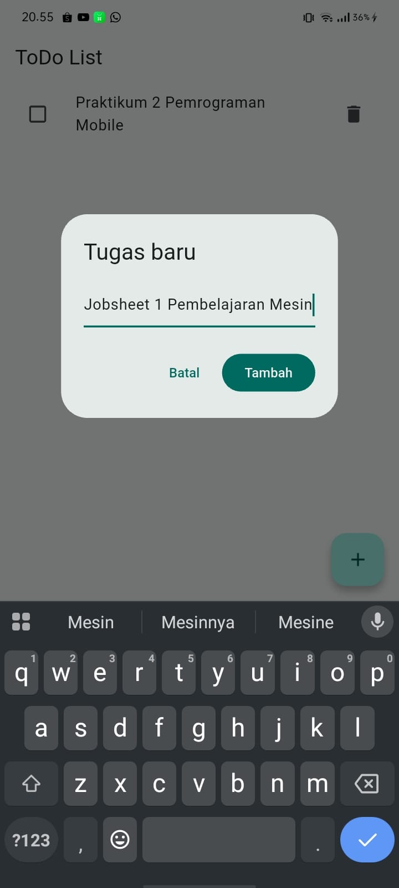
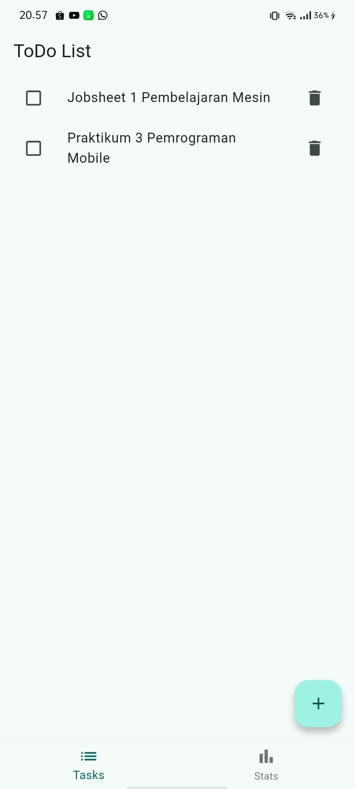
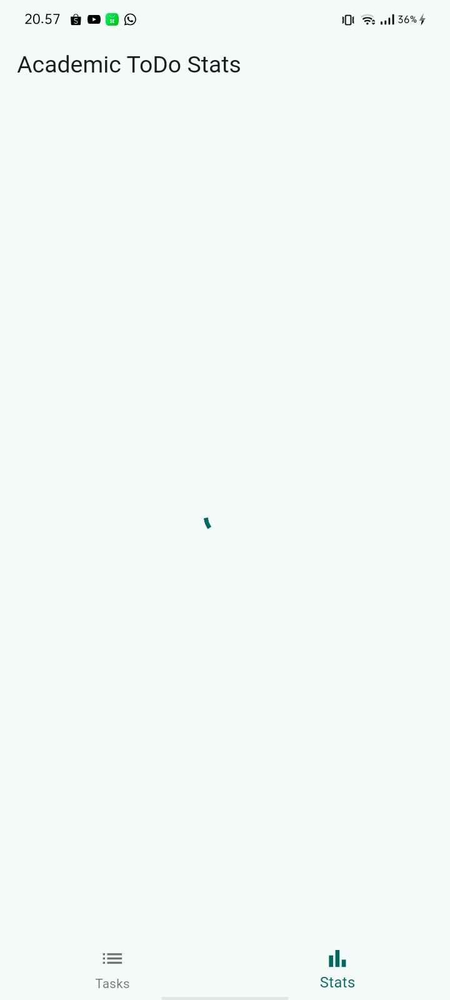
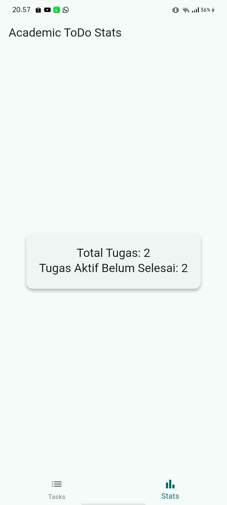
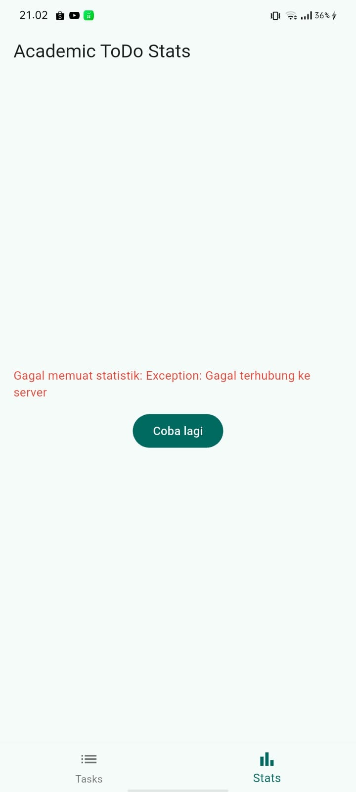
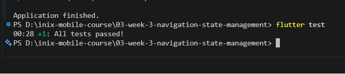

# #03 | Navigation & State Management - ToDo App

Tugas Mingguan Pemrograman Mobile - Week 3. Aplikasi manajemen tugas (ToDo) akademik yang mengintegrasikan sistem navigasi multi-halaman berbasis `GoRouter` dan pengelolaan kondisi aplikasi berbasis `flutter_riverpod`.

---

## Bukti Hasil Jalankan Aplikasi

### 1. Halaman Utama ToDo (Daftar Tugas)

* **Penjelasan:** Gambar di atas menunjukkan halaman utama aplikasi (*TodoPage*) yang menampilkan daftar tugas akademik. Halaman ini dibuat menggunakan `ConsumerWidget` agar bisa memantau perubahan data dari Riverpod secara *real-time*. Komponen barisan list sudah dipisah menjadi widget kustom bernama `TodoTile` agar struktur kode lebih bersih dan mudah diuji.

---

### 2. Tampilan State Loading

* **Penjelasan:** Diambil tepat saat berpindah ke halaman statistik. Sebelum data statistik muncul, aplikasi memproses data asinkron dengan simulasi *delay* selama 2 detik. Selama proses ini, objek `AsyncValue` otomatis mendeteksi kondisi memuat data dan menampilkan roda berputar (*CircularProgressIndicator*) di tengah layar agar pengguna tidak melihat layar putih kosong.

---

### 3. Tampilan State Success

* **Penjelasan:** Gambar di atas menunjukkan kondisi ketika data statistik akademik telah sukses dimuat sepenuhnya. Angka "Total Tugas" dibaca langsung dari `todoListProvider`, sedangkan data "Tugas Aktif Belum Selesai" dihitung secara otomatis menggunakan provider turunan hasil penapisan (*filter*), yaitu `activeTodosProvider`.

---

### 4. Tampilan State Error

* **Penjelasan:** Dokumentasi di atas menunjukkan ketahanan aplikasi saat terjadi kegagalan sistem atau jaringan (disimulasikan dengan melempar *Exception* manual). Berkat penggunaan fungsi `AsyncValue.when`, sistem otomatis menyembunyikan layar utama dan menggantinya dengan pesan error teks merah serta tombol **Coba lagi** (*Retry*) untuk menarik data ulang melalui fungsi `ref.invalidate()`.

---

### 5. Hasil Pengujian Otomatis

* **Penjelasan:** Bukti fisik bahwa aplikasi telah lolos pengujian fungsionalitas otomatis melalui perintah `flutter test` di terminal komputer. Skenario uji coba sukses menyimulasikan penekanan tombol tambah (+), mengetik teks tugas, menekan tombol tambah di dialog box, hingga memverifikasi bahwa teks tugas baru tersebut benar-benar muncul di layar dengan status akhir **All tests passed**.

---

## AI Prompt Challenge & Verification Checklist

### 1. Keamanan Mutasi State
State di dalam `TodoListNotifier` dimutasi secara aman menggunakan operasi *spread operator* `state = [...state, ...]` (Immutability). Tidak ada modifikasi ilegal langsung seperti memanggil fungsi bawaan array `state.add()` yang dilarang keras oleh Riverpod karena menggagalkan rebuild UI secara periodik.

### 2. Penempatan Aturan ref.watch & ref.read
* Aturan `ref.watch` ditaruh secara eksklusif langsung di dalam fungsi struktur `build()` milik komponen UI agar aplikasi otomatis menggambar ulang halaman ketika isi tugas berkurang atau bertambah.
* Aturan `ref.read` hanya dipasang pada lingkup fungsi pencetus aksi tombol dinamis (*callback/event*) seperti aksi `onPressed` agar tidak menciptakan rantai langganan data pasif yang boros memori.

### 3. Penanganan Tiga Kondisi Asinkron AsyncValue
Komponen halaman `StatsPage` telah memetakan tiga status asinkron secara utuh menggunakan fungsi ekstensi `when()` bawaan Riverpod:
* **Loading:** Memunculkan roda berputar (`CircularProgressIndicator`).
* **Error:** Memunculkan deskripsi penyebab kegagalan beserta tombol penarik ulang (*Retry Button*) menggunakan pemanggil fungsi `ref.invalidate()`.
* **Success (Data):** Menampilkan ringkasan kartu informasi statistik secara presisi.

---

## Jawaban Refleksi Laporan Modul

* **Kapan setState masih layak dipakai dan kapan harus naik ke Riverpod?**
  `setState` masih layak dipakai jika perubahan data sifatnya sangat lokal di dalam satu file komponen itu saja (misalnya menyimpan riwayat teks kolom pencarian sebelum dikirim). Namun ketika data tersebut perlu dibaca atau diubah secara gotong royong oleh halaman lain (seperti daftar data ToDo yang dibuat di halaman A namun statistiknya dihitung di halaman B), maka state tersebut wajib dinaikkan ke level global menggunakan Riverpod demi menghindari kendala penumpukan parameter (*prop drilling*).

* **Apa perbedaan mendasar antara context.go dengan context.push di GoRouter?**
  Fungsi `context.go()` memindahkan layar dengan cara menghancurkan atau menimpa tumpukan halaman lama (sangat cocok untuk pengalihan menu utama atau setelah proses keluar akun/logout). Sebaliknya, fungsi `context.push()` menaruh halaman baru tepat di atas tumpukan halaman yang sedang aktif saat ini tanpa menghapus halaman di bawahnya, sehingga pengguna bisa dengan mudah kembali ke halaman awal lewat tombol kembali (*back button*).

* **Bagaimana objek AsyncValue mencegah munculnya bug dibanding tiga variabel boolean manual?**
  Menggunakan tiga bendera boolean manual (seperti `bool isLoading`, `bool isError`, dan `bool isSuccess`) sangat berisiko memicu bug konsistensi logika, di mana ada kemungkinan status `isLoading` dan `isError` secara tidak sengaja bernilai *true* secara bersamaan akibat kesalahan penulisan urutan kode asinkron. `AsyncValue` membungkus ketiga kondisi mustahil tersebut ke dalam satu tipe kesatuan objek yang mutlak (*enum-like structure*), sehingga aplikasi dijamin hanya bisa berada di dalam salah satu kondisi pada satu waktu.
