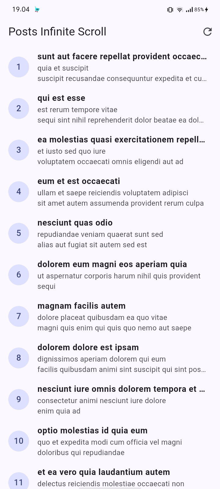
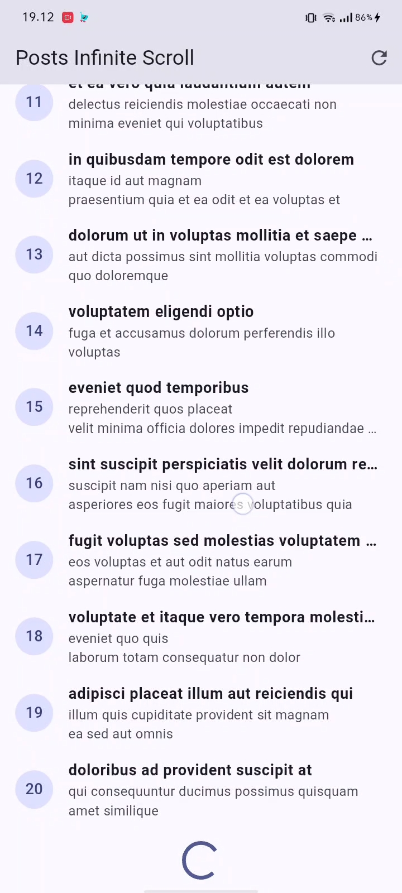
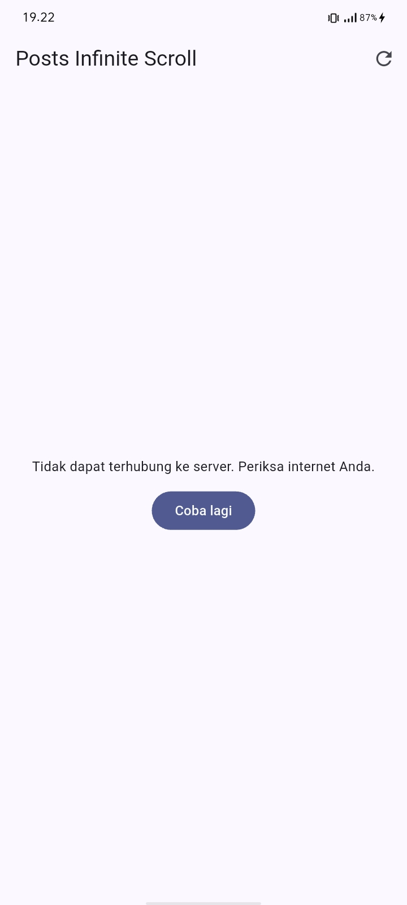

# Laporan Praktikum Pemrograman Mobile
## #04 | Networking & REST API - Infinite Scroll Application

* **Nama Mahasiswa:** Adi Luhung
* **NIM:** 244107020088
* **Kelas:** TI-3D

---

## Fitur Utama Aplikasi
Aplikasi ini menerapkan integrasi data asinkron dari public REST API (JSONPlaceholder) dengan arsitektur modern yang berfokus pada performa dan pengalaman pengguna:
* **Repository Pattern:** Memisahkan logika pengambilan data (HTTP Client menggunakan Dio) dari layer antarmuka (UI).
* **Infinite Scroll Pagination:** Memuat data secara bertahap (per halaman) berdasarkan deteksi posisi guliran layar melalui `ScrollController`.
* **State Management Berbasis Riverpod:** Mengelola siklus data terstruktur (`loading`, `error`, `data`) menggunakan tipe data `Notifier` yang aman dari kebocoran memori.
* **Defensive JSON Parsing:** Pemetaan model data yang dibentengi dengan nilai bawaan (*null safety fallback*) untuk mencegah aplikasi *crash* jika server mengembalikan properti kosong.

---

## Dokumentasi Screenshot & Penjelasan Fitur

Berikut adalah hasil dokumentasi fungsionalitas aplikasi yang dijalankan langsung melalui perangkat fisik (HP):

### 1. Halaman Utama & State Success (Data Berhasil Dimuat)

* **Penjelasan:** Gambar di atas menunjukkan kondisi saat aplikasi berhasil terhubung ke server internet dan menampilkan daftar artikel kiriman. Data dibatasi secara dinamis (limit 20 data per halaman) untuk memastikan konten melewati batas bawah layar gawai sehingga dapat digulir dengan normal.

---

### 2. Tampilan State Loading (Proses Memuat Data)

* **Penjelasan:** Diambil ketika pengguna scroll melewati batas bawah daftar. Komponen roda berputar (*CircularProgressIndicator*) otomatis muncul di bawah layar untuk memvisualisasikan proses penarikan data yang sedang berjalan di latar belakang.

---

### 3. Tampilan State Error (Penanganan Gangguan Jaringan)

* **Penjelasan:** Menunjukkan ketahanan aplikasi saat koneksi internet pada perangkat dimatikan secara sengaja. Melalui kelas `network_errors.dart`, pesan pengecualian (*DioException*) ditangkap lalu diubah menjadi kalimat pemberitahuan yang ramah pengguna, lengkap dengan tombol **Coba lagi** untuk memicu penarikan data ulang.

---

### 4. Hasil Pengujian Unit Otomatis (All Tests Passed)

* **Penjelasan:** Bukti fisik bahwa aplikasi telah lolos pengujian unit terisolasi melalui perintah `flutter test`. Skenario uji coba berhasil memverifikasi bahwa metode `fromJson` aman terhadap kasus data kosong (*edge case null safety*) dan pemetaan pesan error jaringan berjalan 100% akurat.

---

## Hasil Refactoring Challenge
* **Pemisahan Komponen UI (`post_tile.dart`):** Ekstraksi baris komponen dari `ListView.builder` dipisahkan menjadi widget independen demi memangkas siklus konsumsi memori render layar gawai saat digulir cepat.
* **Dekopel Logika Error (`network_errors.dart`):** Seluruh logika pengecekan kode status HTTP (`404`, `401`, `timeout`) dipisah keluar dari kode utama agar pemeliharaan kode jangka panjang menjadi lebih mudah.

---

## AI Prompt Challenge & Verification Checklist

**Teks Prompt Eksperimen yang Digunakan:**
> *"Buatkan repository layer Flutter untuk endpoint GET /comments?postId={id} dari JSONPlaceholder menggunakan Dio + flutter_riverpod dengan syarat penanganan dari null safety defensif, konversi pemetaan error terpisah ramah pengguna, serta satu unit test edge case field kosong."*

### Checklist Bukti Verifikasi Mandiri:
* [x] **Apakah UI memanggil Dio secara langsung?** Tidak, layer antarmuka terisolasi penuh dan hanya diizinkan membaca data penampung dari `pagedPostsProvider`.
* [x] **Apakah fromJson aman null?** Ya, pemetaan model `Post` dan `Comment` dibentengi dengan nilai fallback `??` untuk menghindari error fatal `type 'Null' is not a subtype of type`.
* [x] **Apakah semua tipe DioExceptionType dipetakan?** Ya, kondisi koneksi lambat, bad response, dan timeout sudah memiliki alur penanganan pesan masing-masing.

---

## Jawaban Refleksi Laporan Modul

* **Mengapa UI dilarang keras memanggil Dio langsung? Apa yang rusak jika aturan ini dilanggar?**
  Jika layer UI memanggil koneksi HTTP Client/Dio secara langsung, maka prinsip *Separation of Concerns* (SoC) akan rusak karena logika bisnis dan logika antarmuka bercampur aduk. Dampak fatalnya adalah kode program menjadi sangat sulit diuji melalui *unit testing*, memicu duplikasi kode yang tidak efisien, serta membuat aplikasi rentan mengalami *crash* massal jika terjadi perubahan struktur endpoint di masa mendatang.

* **Kapan pagination client-side cukup, dan kapan harus mengandalkan pagination server-side (`_page` & `_limit`)?**
  Pagination *client-side* hanya cukup digunakan jika volume data berjumlah sedikit dan bersifat statis (di bawah 100 data). Namun, untuk data dinamis berskala besar hingga ribuan (seperti feed berita atau katalog produk), wajib mengandalkan pagination *server-side* agar aplikasi hanya mengunduh data yang sedang dilihat pengguna saja. Langkah ini sangat krusial untuk menghemat bandwidth internet dan menjaga kapasitas RAM ponsel agar tidak cepat panas.

* **Bagaimana eksistensi AsyncValue memangkas kemunculan bug logika dibanding tiga variabel boolean manual?**
  Menggunakan status boolean manual (seperti `bool isLoading`, `bool isError`, dan `bool isSuccess`) sangat berisiko memicu bug konsistensi logika, di mana ada kemungkinan status `isLoading` dan `isError` secara tidak sengaja bernilai *true* secara bersamaan akibat kesalahan penulisan urutan kode asinkron. `AsyncValue` membungkus ketiga kondisi mustahil tersebut ke dalam satu tipe kesatuan objek yang mutlak (*enum-like structure*), sehingga aplikasi dijamin hanya bisa berada di dalam salah satu kondisi pada satu waktu.
